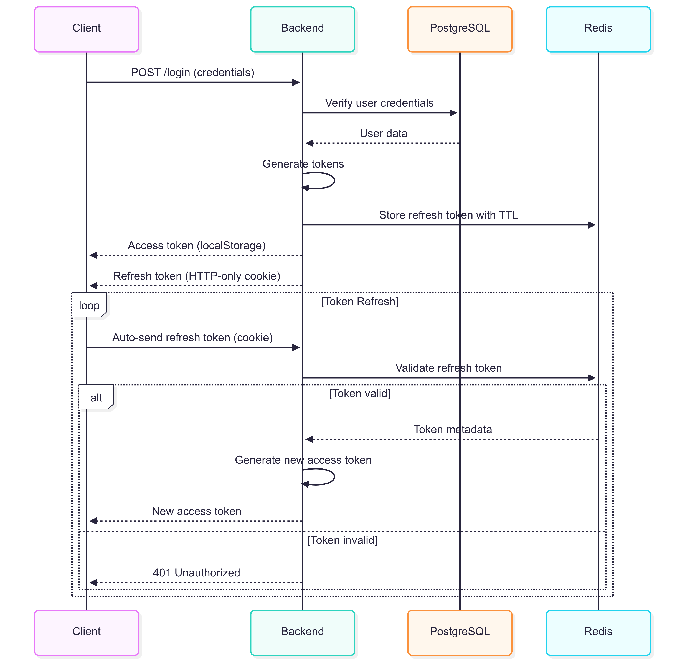
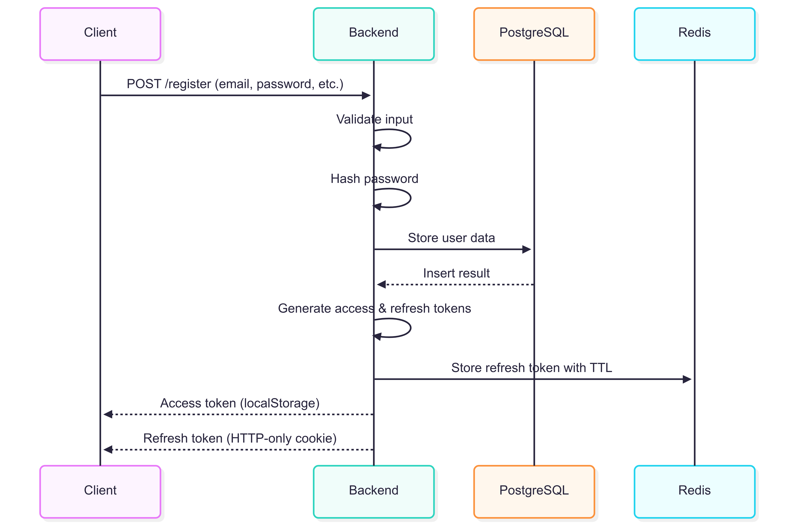
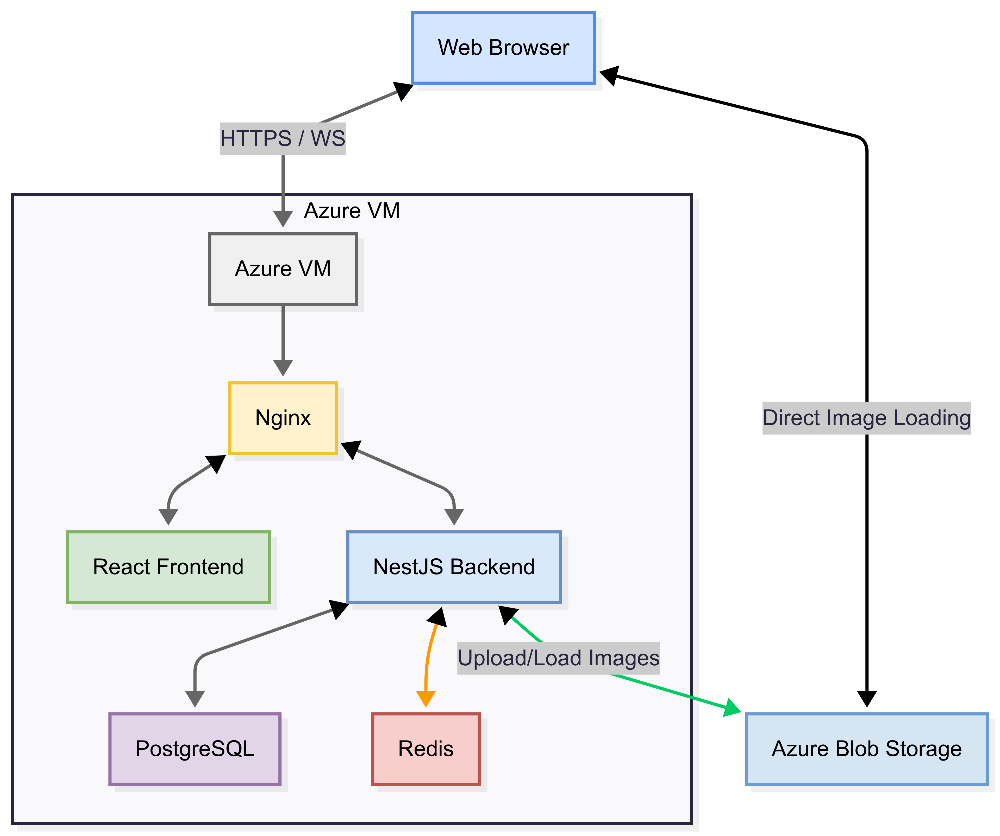

# 📡 Real-Time Chat Backend (NestJS)

This backend system, powered by **NestJS**, is the core engine of a **real-time chat application**. It supports **secure authentication**, **live communication**, and **file handling**, all while being designed for **scalability**, **performance**, and **security** in production environments.

---

## 🔧 Core Features

### 🔐 Authentication System
- JWT-based access and refresh token flow
- Redis-based refresh token storage with TTL
- HTTP-only cookies for refresh tokens; localStorage for access tokens
- Password hashing with bcrypt (12 rounds)
- Endpoints:
  - User registration (with email/password validation)
  - Login (with credential verification)
  - Token refresh
  - Secure logout (token invalidation)
  - Upload images
  - Send and Request messages
  - Get users

### 🗣️ Real-Time Communication
- WebSocket via **Socket.IO**
- Room-based architecture for chat isolation
- Events handled:
  - Send/receive messages
  - User online/offline presence
- Message persistence in **PostgreSQL**

### 📁 File Handling Service
- Azure Blob Storage with SAS token generation (time-limited)
- Metadata stored in PostgreSQL:
  - Storage path

### 🧠 Data Management
- **PostgreSQL**:
  - User accounts and profiles
  - Chat messages
  - File metadata
- **Redis**:
  - Refresh token storage

---

## ⚙️ Operational Capabilities
- Docker containerized deployment
- Horizontal scalability potential
- Structured logging and error handling

---

## 🛡️ Security Highlights
- CSRF protection
- Input validation and sanitization
- Strong password hashing
- HTTPS enforcement
- Configurable CORS policy
- Regular security auditing practices

---

## 🖼️ Architecture & Sequence Diagrams

### 🔄 Login Sequence

### 📝 Registration Sequence

### ☁️ System Cloud Architecture

---

## 🚀 Scalability & Performance

The system is optimized to support **hundreds of concurrent users** with **sub-second response times**, ensuring data consistency and secure communication across all layers.

---

## 📁 Tech Stack

| Layer            | Technology       |
|------------------|------------------|
| Backend Framework| NestJS           |
| Authentication   | JWT, Redis       |
| Real-Time Comm.  | Socket.IO        |
| Database         | PostgreSQL, Redis|
| File Storage     | Azure Blob       |
| Deployment       | Docker           |
| Monitoring       | Health Checks, Logging |
| Testing          | Jest / Supertest |

---

## 🛠️ Continuous Integration & Deployment (CI/CD)

This project uses **GitHub Actions** to automate testing, linting, and building on every push and pull request. CI/CD ensures changes are automatically validated and production-ready.

### 📦 Workflow Highlights
- ✅ ESLint and unit testing with Jest
- 🏗️ NestJS build validation
- 🐳 Docker build pipeline support (optional)
- 🚀 Easily extendable to deploy to Azure, DigitalOcean, or other cloud providers

You can find the workflow definition in `.github/workflows/ci.yml`.

---

## 📬 Contact

For questions, contributions, or bug reports, feel free to open an issue or reach out via the associated GitHub profile.

---
